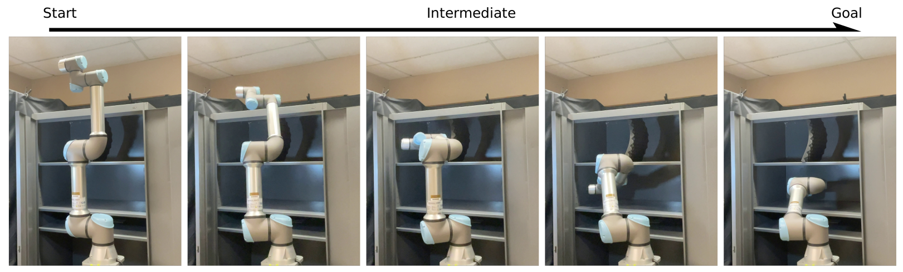
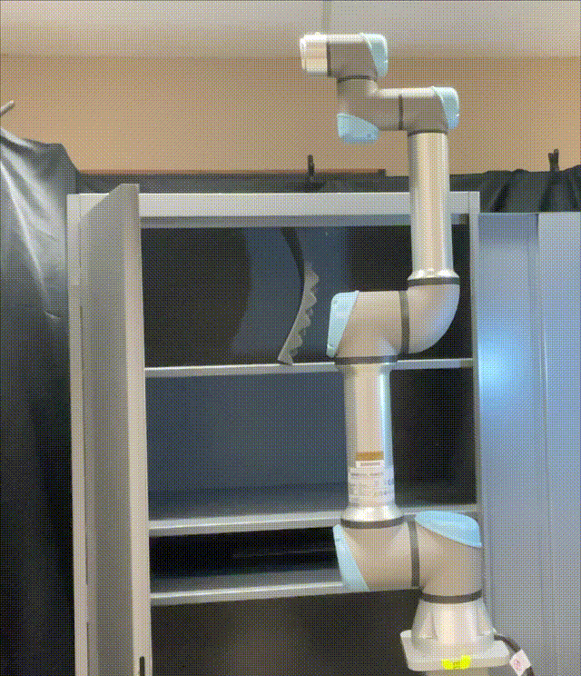
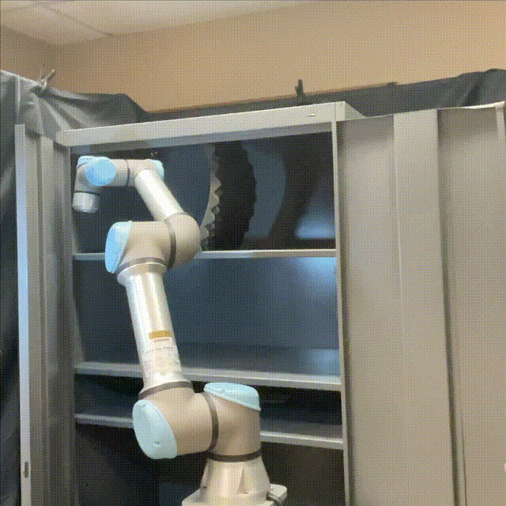

# P-NTFields

>**Progressive Learning for Physics-informed Neural Motion Planning**
\
>[Ruiqi Ni](https://ruiqini.github.io/),
[Ahmed H Qureshi](https://qureshiahmed.github.io/)

_Published in RSS 2023._

## Introduction

This repository is the official implementation of "Progressive Learning for Physics-informed Neural Motion Planning". 

## Videos

|  |  |  |